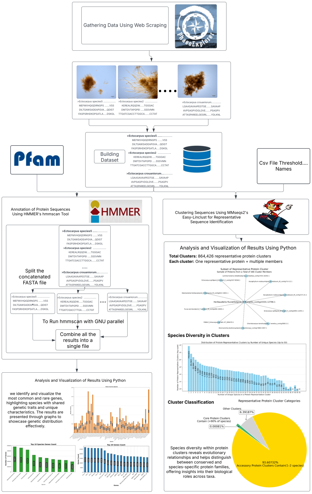

# iCulture Parallelised and Dockerized Workflow

This repository hosts the **iCulture pipeline**, a fully automated, parallelised and Dockerized solution for the analysis of protein sequences. The pipeline enables efficient clustering, domain annotation, and statistical analysis of datasets, with built-in reproducibility using Docker containers.

---

## Pipeline Overview

**Workflow Diagram:**
<p align="center"><a href="#"></a></p>

1. **Preprocessing and Clustering**  
   - The pipeline begins by clustering sequences using **MMseqs2 easy-linclust** for deduplication and grouping similar sequences.
   - This step generates representative sequences and cluster files based on user-defined thresholds for identity and coverage.

2. **Domain Annotation**  
   - Representative sequences are annotated using **HMMER** with the **Pfam-A.hmm** database. 
   - Sequences are split into smaller chunks for parallel processing using **GNU parallel**, dramatically improving runtime for large datasets.

3. **Statistical Analysis and Visualization**  
   - Parsed annotation results are used to generate:
     - Statistics on total and unique genes.
     - Gene distribution across species.
     - Presence/absence matrices for species and protein domains.
   - Visualizations include:
     - Top domains count.
     - domains count by species.
     - Distribution of common domains across species.

4. **Output**
   - Results include tables and visualizations saved in user-specified output directories.

---

## How to Acquire and Use Docker Images

### 1. MMseqs2 Docker Image
- **Required for clustering in step 1.**
- Acquire from [MMseqs2 Docker Hub](https://hub.docker.com/r/soedinglab/mmseqs2) using:  
  ```bash
  docker pull soedinglab/mmseqs2

### 2. iCulture HMMER + Python Image

The iCulture HMMER + Python Docker image is prebuilt for annotation, visualization, and statistical analysis in steps 2 and 3 of the pipeline. It includes:

- **HMMER (v3.9)** for domain annotation.
- **SeqKit (v2.9)** for sequence splitting.
- **Python (v3.9)** with necessary libraries such as Biopython, Matplotlib, and Pandas.

#### Acquire the Image
You can pull the prebuilt image from Docker Hub using the following command:
```bash
docker pull mahmoudbassyouni/iculture-hmmscan-python:v1
```
**For more information on how to install Docker, if you don't have it, visit here**: [Docker Website](https://docs.docker.com/engine/install/)

---
## Datasets

The main dataset for the pipeline is the **Brown Algae dataset**, sourced from the [Phaeoexplorer Project](https://phycoweb.net/). Due to size constraints, the dataset is hosted externally and can be downloaded from **Zenodo**:

- **Dataset Download Link:**  
  [Brown-Algae Dataset](https://zenodo.org/records/14578162/files/Brown-Algae.dataset.tar.gz?download=1)

### Instructions for Downloading and Extracting
To include the dataset in your workflow, download and extract it into a `dataset/` folder within the root directory of the cloned repository:

```bash
wget -O Brown-Algae.dataset.tar.gz https://zenodo.org/records/14578162/files/Brown-Algae.dataset.tar.gz?download=1
mkdir dataset
tar -xzvf Brown-Algae.dataset.tar.gz -C dataset/
```
Once extracted, the dataset/ folder will contain the necessary FASTA and HMMER files for pipeline execution.

---
## Test Species

The repository includes two test species, which are subsets of the Brown Algae dataset, used to test and validate the reproducibility of the pipeline. These species are included in the `test-species/` folder and are provided as example input data for the pipeline.

### Included Test Species
1. **Sphaerotrichia firma**
2. **Sphacelaria rigidula**

### Usage
These test species can be replaced with any other FASTA files if you wish to run the pipeline on a different dataset. Ensure that the new FASTA files are correctly referenced in the `samplesheet.csv` file, which defines the species and their respective input files.

### Additional Notes
To facilitate the creation of a `samplesheet.csv` file for the input data, use the `bin/samplesheet-generator.sh` script. Similarly, thresholds for clustering can be defined using the `bin/thresholds-generator.sh` script.

---
## Usage Instructions

Follow these steps to run the pipeline:

### 1. Clone the Repository
```bash
git clone https://github.com/Mohamedema/ICulture.git
cd ICulture
```
### 2. Download the Dataset
The dataset is hosted on Zenodo and can be downloaded using the link below:
  [Download Brown Algae Dataset](https://zenodo.org/records/14578162/files/Brown-Algae.dataset.tar.gz?download=1)

Extract the dataset into your working directory:
```bash
mkdir dataset
tar -xvzf Brown-Algae.dataset.tar.gz -C dataset
```
### 3. Pull Required Docker Images
1.Pull the iCulture HMMER + Python image:
```bash
docker pull mahmoudbassyouni/iculture-hmmscan-python:v1
```
2.Pull the MMseqs2 image from Docker Hub:
```bash
docker pull soedinglab/mmseqs2
```
### 4. Generate Required Input Files
- Generate samplesheet.csv:
```bash
./bin/samplesheet-generator.sh
```
- Generate thresholds.csv:
```bash
./bin/thresholds-generator.sh
```
### 5. Run the Pipeline
Run the main pipeline script with the required inputs:
```bash
./bin/iculture-pipeline-parallel.sh -d dataset/brown-algae_dataset.fa \
                                    -s samplesheet.csv \
                                    -h thresholds.csv \
                                    -p dataset/Pfam-A.hmm \
                                    -o results/ \
                                    -t 30 -m 24
```
### 6. View Results
- Output files, tables, and visualizations are stored in the results/ directory.
---
## Pipeline Parameters

The pipeline script accepts the following parameters:

### Required Parameters
1. **`-d <database_fasta_file>`**  
   Path to the main database FASTA file containing reference sequences.

2. **`-s <sample_sheet_csv>`**  
   Path to the CSV file containing species names and their corresponding protein FASTA file paths.  
   **Format:** species_name,protein_fasta_path
3. **`-h <thresholds_csv>`**  
Path to the CSV file specifying identity and coverage thresholds for clustering.  
**Format:**  Identity,Coverage
4. **`-p <pfam_hmm_db>`**  
Path to the Pfam HMM database file, which will be used for HMMER annotation.

5. **`-o <output_directory>`**  
Path to the directory where output files will be saved.

### Optional Parameters
1. **`-t <hmmer_threads>`**  
Number of threads for HMMER annotation using GNU Parallel.  
**Default:** 4  

2. **`-m <mmseqs_threads>`**  
Number of threads for MMseqs easy-linclust.  
**Default:** 32

	•	Make sure all input files (e.g., Pfam-A.hmm) are correctly formatted and paths are accurate.
   
---
## Results Directory

The `results/` directory is the main output folder generated after running the pipeline. It contains various files, tables, and visualizations summarizing the analysis. Below is an overview of its contents:

---

### Subdirectories and Files

1. **Main Outputs (`results/`)**  
   - Contains the primary outputs of the pipeline, including clustering results, presence/absence matrices, and combined HMMER outputs.

2. **Visualization Results (`results/visualization_results/`)**  
   - **Parsed_hmmscan_tbl.csv:** CSV file with parsed results from the HMMER output.  
   - **Top_20_Protein_Domains_count.png:** Bar plot of the top 20 protein domains based on occurrence.  
   - **Protein_Domains_count_by_species.png:** Bar plot showing protein domains counts grouped by species.  
   - **Top_10_Species_Protein_Domains_Count.png:** Visualization of the top 10 species with the highest protein domains counts.  
   - **Table_Protein_Domains_Count_Found_In_All_Species.csv:** Protein domains found across all species.  
   - **Table_Protein_Domains_Count_Found_In_One_Species_Only.csv:** Protein domains unique to a single species.

3. **Presence/Absence Matrix (`results/`)**  
   - **linclust_<parameters>_presence_absence_matrix.tsv:** Tab-separated file of a 0/1 encoded matrix summarizing protein domains absence/presense across species.

4. **HMMER Outputs (`results/`)**  
   - **combined_results_1_to_<threads>.tbl:** Combined results from parallel HMMER runs.

---

### Key Files

1. **`concatenated_protein.fasta`**  
   - **Description:** A combined FASTA file containing protein sequences from all the input species.  
   - **Use Case:** Used as input for clustering and further analyses.

2. **`linclust_<parameters>_all_seqs.fasta`**  
   - **Description:** Contains all sequences from the clustering step for the given parameters (e.g., identity and coverage thresholds).  
   - **Use Case:** Provides insights into how sequences were grouped during clustering.

3. **`linclust_<parameters>_cluster.tsv`**  
   - **Description:** Tab-delimited file listing clusters and their corresponding sequences for the specified clustering parameters.  
   - **Use Case:** Used to examine the clustering results and identify relationships between sequences.

4. **`linclust_<parameters>_rep_seq.fasta`**  
   - **Description:** Contains representative sequences for each cluster, generated based on the chosen thresholds.  
   - **Use Case:** Used as input for further functional annotation and analysis.

5. **`modified_<species-name>.fasta`**  
   - **Description:** Contains cleaned and formatted protein sequences for a specific species, ready for processing in the pipeline.  
   - **Use Case:** Ensures standardized input for clustering and annotation.

---

### Subdirectories

1. **`tmp/`**  
   - **Purpose:** Temporary directory created during MMseqs2 clustering or other intermediate steps.  
   - **Content:** Intermediate files generated by the pipeline that are not required for final results but aid in speeding up the processing.  
   - **Note:** Can be deleted after the pipeline completes to free up disk space.

2. **`split_fasta/`**  
   - **Purpose:** Stores the output of the FASTA splitting process.  
   - **Content:** Contains multiple smaller FASTA files (`concatenated_protein.part_001.fasta`, `concatenated_protein.part_002.fasta`, etc.) generated using `seqkit`.  
   - **Use Case:** These split files are used to parallelize the HMMER annotation step.

3. **`parallel_results/`**  
   - **Purpose:** Stores the output files of the HMMER annotation step, run in parallel for each split FASTA file.  
   - **Content:** Individual result files generated by HMMER (`results_concatenated_protein.part_001.tbl`, `results_concatenated_protein.part_002.tbl`, etc.).  
   - **Note:** These files are combined into a single consolidated output (`combined_results.tbl`) as part of the final pipeline step.
---
## Acknowledgments
This pipeline was developed as part of the **iCulture Project** to facilitate the reproducible analysis of protein sequences in brown algae datasets. It leverages tools like **MMseqs2**, **HMMER**, and **Python** for scalable bioinformatics workflows.
